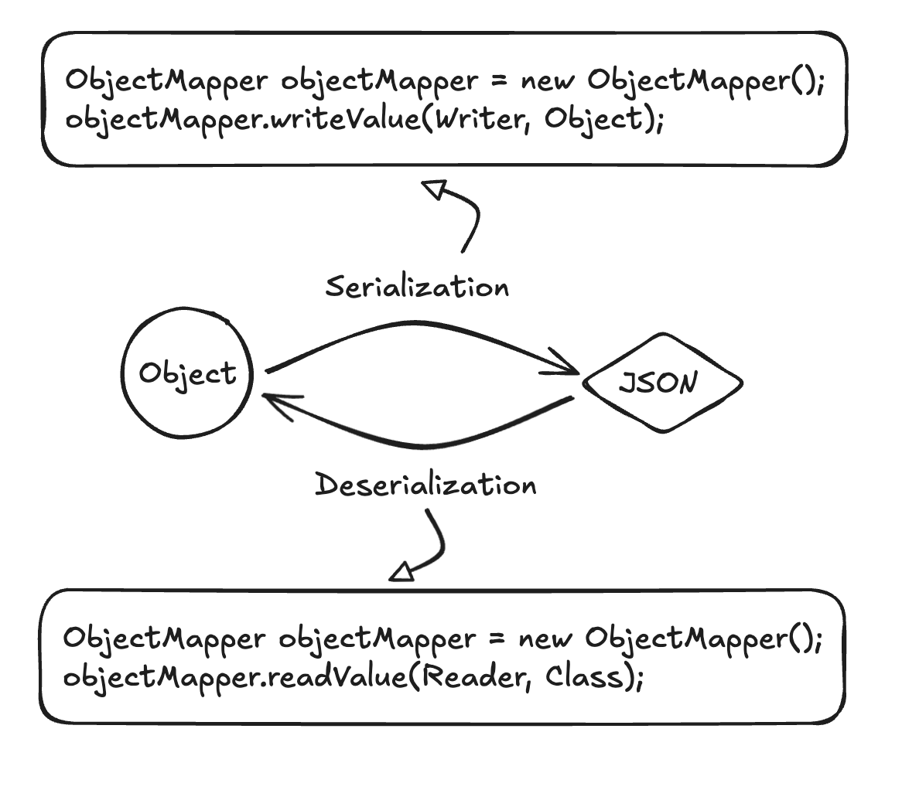

# Files API

When we **create**, **read**, or **write** a file, there are standard modes that you can use to do so.

Java uses the *StandardOpenOptions* class to encapsulate all these modes.

- READ: Open a file for reading, fail if it doesn't exist.
- CREATE: Create a file.
- CREATE_NEW: Same as CREATE, but fail if the file already exists.
- WRITE: Open a file for writing.
- APPEND: Same as WRITE, but write to the end of the file.

# Path API

A Path is Java's way to refer to a file on a file system:

`Path p = Path.of("your/path/here");`

# Reading and Writing Data in Java

In Java, the utilities for reading and writing data are built on top of each other.

When we use a *BufferedReader* to read lines of text, that buffered reader is reading from another underlying *Reader*
that
provides characters of text.

That Reader, in turn, is itself using an *InputStream* behind the scenes to read the raw data.


## Input & Output Streams

These are the lowest level APIs Java offers for reading or writing a stream of bytes (raw data).

This data can come from a file, from user input on the command-line, or from a network or other source.

We use them to:

- access low-level bytes of data from input;
- write bytes to output.

When would we need to write code that directly uses *InputStream*s and *OutputStream*s?

- When there's a need to access low level bytes of dta, like implementing a custom network protocol or file format.

```
InputStream in = Files.newInputStream(Path, StandardOpenOptions);
OutputStream out = Files.newOutputStream(Path, StandardOpenOptions);
in.read(byte[]);
out.write(byte[]);
in.close();
out.close();

Files.copy(Path, Path);
```

## Readers & Writers

Readers and Writers are the next level of abstraction built on top of input and output streams.

These interfaces read and write text characters.

```
Reader reader = Files.newBufferedReader(Path, Charset);
reader.read(char[])
reader.close();
```

```
Writer writer = Files.newBufferedWriter(Path, Charset);
writer.write("test");
writer.close();
```

## Buffered Streams

# Java Object Serialization

In Java, the most popular library for doing this is **Jackson**.

Why would we need to serialize a Java Object?

- To save its contents to a file.
- To send it over a network.


