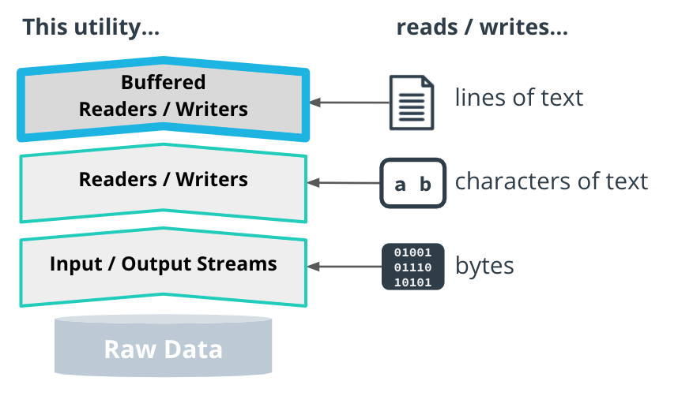

# Files API

When we **create**, **read**, or **write** a file, there are standard modes that you can use to do so.

Java uses the *StandardOpenOptions* class to encapsulate all these modes.

- READ: Open a file for reading, fail if it doesn't exist.
- CREATE: Create a file.
- CREATE_NEW: Same as CREATE, but fail if the file already exists.
- WRITE: Open a file for writing.
- APPEND: Same as WRITE, but write to the end of the file.

# Path API

A Path is Java's way to refer to a file on a file system:

`Path p = Path.of("your/path/here");`

# Reading and Writing Data in Java

In Java, the utilities for reading and writing data are built on top of each other.

When we use a *BufferedReader* to read lines of text, that buffered reader is reading from another underlying *Reader*
that
provides characters of text.

That Reader, in turn, is itself using an *InputStream* behind the scenes to read the raw data.



## Input & Output Streams

These are the lowest level APIs Java offers for reading or writing a stream of bytes (raw data).

This data can come from a file, from user input on the command-line, or from a network or other source.

We use them to:

- access low-level bytes of data from input;
- write bytes to output.

When would we need to write code that directly uses *InputStream*s and *OutputStream*s?

- When there's a need to access low level bytes of dta, like implementing a custom network protocol or file format.

```
InputStream in = Files.newInputStream(Path, StandardOpenOptions);
OutputStream out = Files.newOutputStream(Path, StandardOpenOptions);
in.read(byte[]);
out.write(byte[]);
in.close();
out.close();

Files.copy(Path, Path);
```

## Readers & Writers

Readers and Writers are the next level of abstraction built on top of input and output streams.

These interfaces read and write text characters.

```
Reader reader = Files.newBufferedReader(Path, Charset);
reader.read(char[])
reader.close();
```

```
Writer writer = Files.newBufferedWriter(Path, Charset);
writer.write("test");
writer.close();
```

## Buffered Streams

The most common **buffered streams** are *BufferedReader*s and *BufferedWriter*s,
which read and write lines of text.

When we call *read()*, the *BufferedReader* reads ahead, and fetches more data than asked for.

It is stored in an array (a.k.a., *buffer*).

### BufferedReader

The Files API only returns buffered readers.

The main difference between *BufferedReader* and *Reader* is the *readLine* method,
which returns a full line of text.

```
BufferedReader reader = Files.newBufferedReader(Path, Charset);
reader.readLine();
reader.close();
```

### BufferedWriter

*BufferedWriter* also uses an in-memory buffer to store writes,
and then periodically writes contents of the buffer in batches.

```
BufferedWriter writer = Files.newBufferedWriter(Path, Charset);
writer.write("Hello, ");
writer.write("world!");
writer.flush();  // Writes the contents of the buffer
writer.close();  // Flushes the buffer and closes "test"
```

# Preventing Resource Leaks

## try-catch-finally

The code in the *finally* block is guaranteed to execute after the code in the *try* block,
even if the *try* block **returns** a value or **throws** an exception.

```
Writer writer;
try {
  writer = Files.newBufferedWriter(Path.of("test"));
  writer.write("Hello, world!");
} finally {
  writer.close();
}
```

## try-with-resources

Resources initialized in this way are **guaranteed to be closed** after the *try* block finishes executing.

```
try (InputStream in   = Files.newInputStream(Path.of("foo"));
     OutputStream out = Files.newOutputStream(Path.of("bar"))) {
  out.write(in.readAllBytes());
}
```

# Java Bean

A **class** representing a custom data type.

It stores each piece of info in an instance field.

Each field has a corresponding getter - *getProperty()* - and setter - *setProperty(property)*.

```
public class Client {
  private int id;
  private String name;
  private List<String> emails;
  
  public int getId() { return id; }
  public String getName() { return name; }
  public List<String> getEmails() { return emails; }
  
  public void setId(int id) { this.id = id; }
  public void setName(String name) { this.name = name; }
  public void setEmails(List<String> emails) { this.emails = emails; }
}
```

# Java Object-JSON Serialization

In Java, the most popular library for doing this is **Jackson**.

Jackson uses Java's Reflection APIs to examine the class structure at run time,
and make serialization/deserialization decisions based on what it finds.

Why would we need to serialize a Java Object?

- To save its contents to a file.
- To send it over a network.


