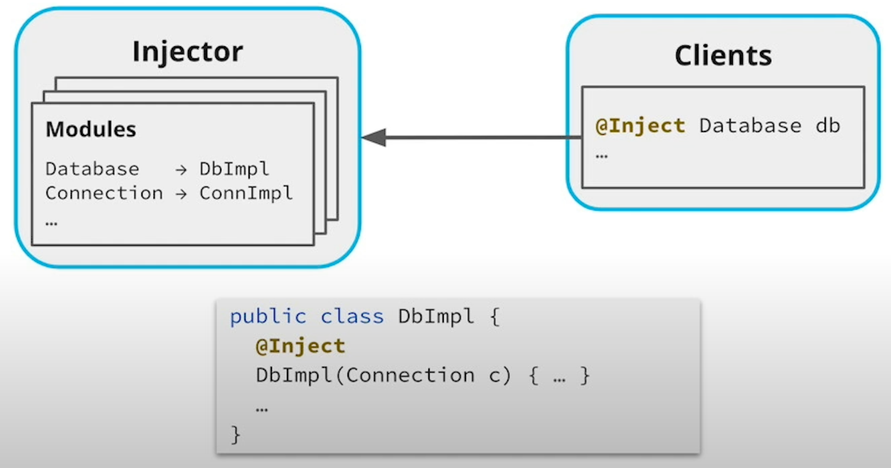

# Design Patterns

**Design pattern**: general solution to certain kinds of common design issues that occur in software development.

- **Creational** patterns (deal with creating objects)
    - Singleton
    - Abstract Factory
    - Factory Method
    - Builder
    - Prototype
- **Behavioral** patterns (deal with how different objects interact)
    - Strategy
    - Template Method
    - Observer
    - Chain of Responsibility
    - Command
    - Iterator
    - Mediator
    - Memento
    - State
    - Visitor
- **Structural** patterns (deal with how different objects fit together)
    - Adapter
    - Decorator
    - Proxy
    - Bridge
    - Composite
    - Facade
    - Flyweight

## Creational Patterns

### Singleton Pattern

May want to use if:

- Class has only 1 instance, but no clear owner.
- We want that instance to be available everywhere in the code.
- The instance is initialized only when it's first used (a.k.a., *lazy initialization*).

```java
public final class Database {
    private static Database database;

    private Database() {}

    public static Database getInstance() {
        if (database == null) {
            database = new Database();
            // ...
        }

        return database;
    }
}
```

Disadvantages:

- Can cause brittle assumptions in the code (if later on, we need multiple instances of the
  class, we might have to refactor a bunch of code).
- Can become hard to test (e.g., we want to use a fake DB to test the client - consider
  dependency injection to manage the singletons).

### Abstract Factory Pattern

**Factory**: anything that creates objects; useful for hiding construction details from callers.

- **Factory method**: a method creating the object (e.g., *Stream.of()*).
- **Abstract factory**: an object creating the object (useful to separate construction of objects into a separate Java
  interface).

Use if we want to:

- Hide construction details from callers.
- Encapsulate construction of several related objects into a single Java interface.

Useful because:

- Can return different implementations of an interface, depending on how the factory is invoked.
- Can create several related kinds of objects.
- Allow to delegate the construction of objects.

### Builder Pattern

**Builder**: *mutable factory* that constructs the state of a to-be-created object, property by property, and then
builds the object.

- Usually supports *method chaining*.
- Often used to create *immutable* data objects.

Useful because:

- Lets us create mutable versions of immutable objects.
- Holds state that can be mutated before building an object.
- Can improve the API for object creation, especially when the class being instantiated has lots of constructor
  parameters.

## Behavioral Patterns

### Strategy Pattern

Different implementations of a task interface can be swapped at runtime.

- An *interface* represent a *task* or problem (there may be many concrete implementations).
- Each concrete implementation defines a different "strategy" for solving the task.
- The strategies can be swapped for each other because callers code against the interface.

When the task is a functional interface, we can use lambas to implement concrete strategies.

### Template Method Pattern

Subclasses extend a base class and override different placeholder methods.

- We define a **base class** or interface for a procedure or algorithm, but leave **empty placeholders** for some parts
  of the procedure.
- Each placeholder is a blank or default **method** in the base class.
- This base class acts as a **template**.
- Callers fill in the blanks by **extending** the base class and **overriding** the placeholder methods.

### Observer Pattern

A "subject" notifies one or more subscribers that something has changed about the subject.

## Structural Patterns

### Adapter Pattern

Its main purpose is to transform one API/interface into another one.

### Decorator Pattern

Adds new functionality to an existing object dynamically by "wrapping" it, favoring composition.

### Proxy Pattern

Controls access to delegate object.

#### Adapter vs Decorator vs Proxy:

- Both "wrap" another object, called the **delegate**.
- An **Adapter** returns a **different interface** than the delegate.
- A **Decorator** returns the **same interface**, but with **added functionality** or responsibilities.
- A **Proxy** is similar to a Decorator, but the proxy usually **controls or manages access** to the delegate.

## Dependency Injection (DI)

- Creational / architectural pattern - not originally in the Gang of Four Design Pattrens (1994).

**Dependency**: anything the code needs to work (e.g., external library, environment variable, remote website,
database, ...).

**Dependency in the context of dependency injection**: object / class / interface that the code imports / creates /
uses.

**Dependency Injection**:

- Moves the creation of dependencies to outside the code.
- Instead of creating objects, we tell the DI framework to create the objects, and then we inject those objects into the
  class.

### Using @Inject Annotations

To inject objects from a DI framework (e.g., Guice, Spring, ...), we can add *@Inject* annotations to the code.

We can:

- add them directly to instance fields (can save some lines of code).
- add *@Inject* annotations to constructors (allows us to mark the fields final).

```java
class CourseRegistrar {
    @Inject private Database db;
    @Inject private Clock clock;
    @Inject private RegistrationFactory factory;
    // ...
}

// ---

class CourseRegistrar {
    private final Database db;
    private final Clock clock;
    private final RegistrationFactory factory;

    @Inject
    CourseRegistrar(Database db, Clock clock, RegistrationFactory factory) {
        this.db = db;
        this.clock = clock;
        this.factory = factory;
    }
    // ...
}
```

The class doesn't contain any direct instantiation code:

- it injects the factory.
- it injects the database singleton.
- we're getting the time from the Clock interface (no direct dependency on the system timer).
- unit tests can inject a fake clock into the clock field in order to make the class easier to test.

### How DI Injects Objects

The DI framework will:

- *attempt* to instantiate any object that's injected.
- fail at runtime if it doesn't know how to create the injected object.

DI frameworks use *modules* to configure which classes / objects should be used when an interface is injected.

At a high level, modules tell the DI framework which classes or objects should be used when
the client asks for an interface.


When the injector (or container) is asked for a database, it will try to create and return an instance of the *DbImpl*
class which implements the database interface.

#### Indirect Dependencies

DI takes care of indirect (or transitive) dependencies:

- If we *@Inject* a class, and that class also has a constructor marked with *@Inject*, the DI framework will try to
  inject all the constructor dependencies, and all those dependencies' dependencies, and so on.

#### Using DI to Create Singletons

DI frameworks can be *configured* to return a *specific instance* of an object whenever it's injected:

- Any time that object is requested by an *@Inject* annotation, the DI framework will supply the same instance, making
  it a singleton.

### Example

- Class

```java ExpirationChecker.java
public final class ExpirationChecker {
    private final Clock clock;
    private final MetadataFetcher metadataFetcher;

    @Inject
    ExpirationChecker(Clock clock, MetadataFetcher metadataFetcher) {
        this.clock = clock;
        this.metadataFetcher = metadataFetcher;
    }
    //...
}
```

- Module

```java ExpirationCheckerModule.java
public final class ExpirationCheckerModule extends AbstractModule {
    @Override
    protected void configure() {
        bind(MetadataFetcher.class).to(MetadataFetcherImpl.class);
        bind(Clock.class).toInstance(Clock.systemUTC()); // singleton instance
    }
}
```

- Main

```java Main.java
public final class Main {
    public static void main(String[] args) {
        Injector injector = Guice.createInjector(new ExpirationCheckerModule());
        ExpirationChecker checker = injector.getInstance(ExpirationChecker.class);
        // ...
    }
}
```

- Test

```java ExpirationCheckerTest.java
public final class ExpirationCheckerTest {
    public static void main(String[] args) {
        FakeClock fakeClock = new FakeClock();
        Map<Path, Instant> fakeModifiedTimes = new HashMap<>();
        FakeMetadataFetcher fakeMetadataFetcher = new FakeMetadataFetcher(fakeModifiedTimes);

        Injector injector = Guice.createInjector(
                b -> b.bind(Clock.class).toInstance(fakeClock),
                b -> b.bind(MetadataFetcher.class).toInstance(fakeMetadataFetcher));
        ExpirationChecker checker = injector.getInstance(ExpirationChecker.class);
        // ...
    }
}
```