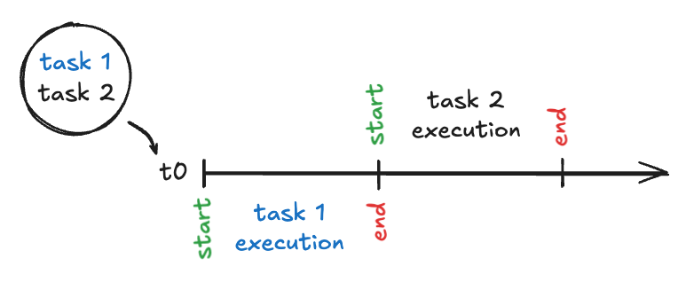
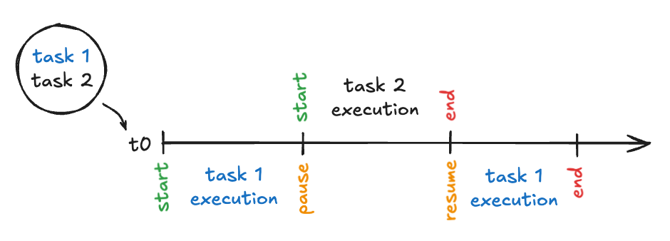
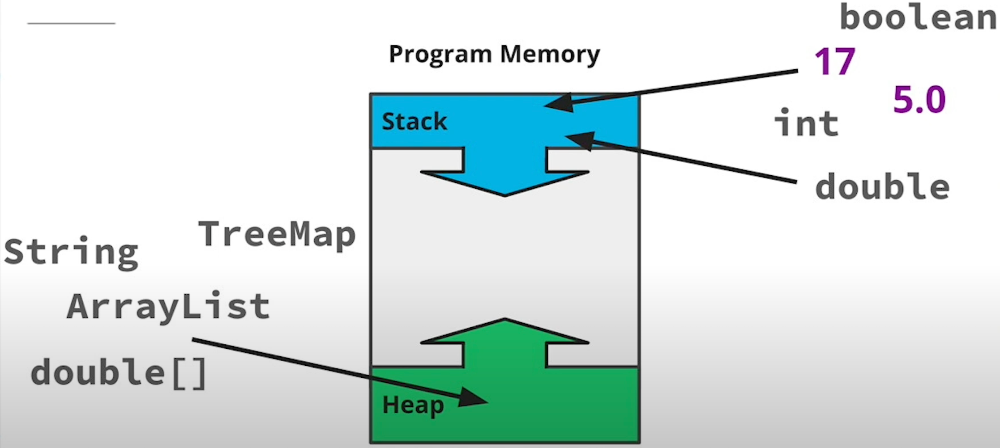
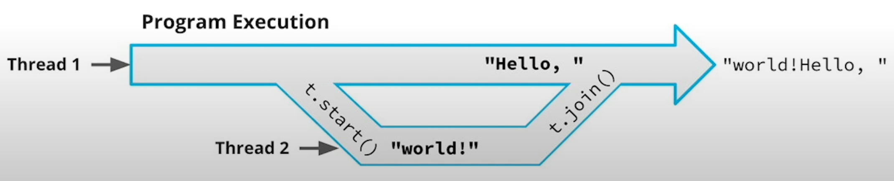
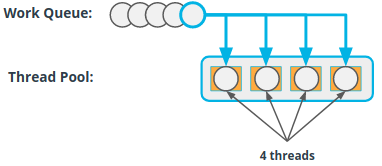
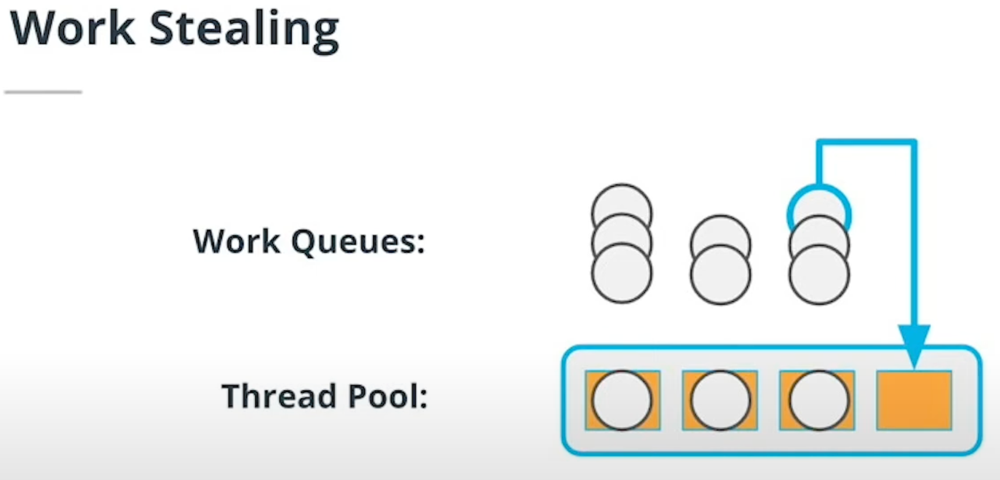
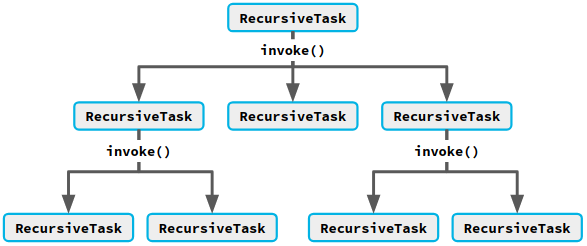

# Sequential vs Concurrent vs Parallel Programs

## Sequential

- Can only work on one task at a time.
- "You start the laundry machine, and then sit and wait for it to finish before starting the next load."



## Concurrent

- Can have multiple tasks in progress at the same time.
- "You start the laundry machine. While it's running, you go fold some other clean clothes."



- In the process of working, the program reaches a point where it can't make anymore progress on task 1.
- It pauses task 1 (saves its progress), and sets it aside to finish later;
  while it's waiting, it starts working on task 2.
- Task 1 is being processed concurrently with task 2: both tasks are in progress at the same time, even if the server
  isn't actively working on both of them at the same time.

## Parallel

- Can actively be working on multiple tasks at the same time.
- "You buy another laundry machine, and then you run two loads of laundry at the same time."


- Parallel programs are concurrent too:
    - At a point in time, tasks 1, 2, and 3, are all being processed concurrently.
    - Tasks 2 and 3 are being processed in parallel.

# Threads

## Program Memory (Stack and Heap)

- Program memory contains:
    - **Stack** - contains variables and primitive values.
    - **Heap** - contains objects.



- When a program creates new threads, it allocates a separate **stack** for each thread.
- But they all use the same **heap**.


- 2 threads can have a reference to the *same object*:
    - E.g., 2+ threads accessing shared state (e.g., *ArrayList*, *HashMap*, ...).
- If a thread tries to use more **stack** space than is allocated for it, the **stack** will overflow, an exception will
  be thrown, and the thread will stop running.

## Creating and Running Threads

```
Thread thread = new Thread(() -> System.out.print("world!"));

System.out.print("Hello, ");

thread.start();
thread.join();
```

- When calling the *Thread* constructor, we pass in an implementation of the *Runnable* interface
  (a subclass or a lambda).


1. The **main thread** *creates* a **2nd thread** *without starting* it
2. The **main thread** prints "Hello, " to the terminal.
3. The **main thread** calls the *start* method to start running the **2nd thread**.
4. The **2nd thread** prints "world!" to the terminal.
5. The **main thread** calls the *join* method.
6. This method *waits* for the **2nd thread** to finish and then *destroys* the **2nd thread**.
7. "Hello, world!" has been printed to the terminal.

# Thread Execution Order

When we have a bunch of threads running at the same time, they execute in seemingly random order
because threads are run by the **operating system's thread scheduler**.

```
Thread thread = new Thread(() -> System.out.print("world!"));
thread.start();

System.out.print("Hello, ");

thread.join();
```

There are 2 possible outcomes:

1. The **1st thread** *starts* the **2nd thread** and then prints "Hello, ".
   Then, the **2nd thread** prints "world!" and *joins* back to the main thread.
2. The **1st thread** *starts* the **2nd thread**, which immediately runs and prints "world!".
   Then the **1st thread** prints "Hello, " and the **2nd thread** is *joined* back to the **main thread**.
   The end result printed to the terminal is backwards now.



A **Race Condition** is a bug that happens when the correctness of a program
depends on a particular execution order of parallel threads.

# Thread Pools and Executors

In practice, we won't usually create threads directly: modern multi-threaded Java programs use **thread pools**
instead.

**Thread pool**: *collection of threads* to execute and manage *asynchronous* work.



**Thread pools** reduce the cost of using threads by storing them in a *worker thread pool*.

## Benefits of Thread Pools

**Thread pools** have advantages over using *Thread* objects directly:

- *Limits the number of threads* used by the program, and prevents the number of threads from growing in an unbounded
  manner.
- *Reuses worker threads*, which reduces the time and memory spent creating new threads.

## Creating Thread Pools

In Java, **thread pools** are created using the *Executors* API (it has lots of other options).

- Thread pool with 1 thread:

`ExecutorService pool = Executors.newSingleThreadExecutor();`

Useful in testing situations, or to guarantee that a piece of work does not run on multiple threads.
___

- Thread pool that reuses threads but does not limit the number of threads it can create:

`ExecutorService pool = Executors.newCachedThreadPool();`

If all the threads in the thread pool are busy, the thread pool will create and add another thread to the pool and use
that instead.
___

- Thread pool that reuses threads and limits the number of threads to 12:

`ExecutorService pool = Executors.newFixedThreadPool(12);`

If new work is submitted and all 12 threads are busy doing other work, the new work will have to wait its turn for a
thread to become available.

## Submitting Asynchronous Work To Thread Pools

**Thread pools** have several methods that let submit work to be executed *asynchronously*:

- *submit*: Submits an implementation of the *Runnable* interface with **no return value**, and returns a *Future*:

`Future<?> print = pool.submit(() -> System.out.println("foo"));`
___

- *execute*: Submits an implementation of the *Runnable* interface and returns *void*:

`pool.execute(() -> System.out.println("foo"));`
___

- *submit*: Submits an implementation of the *Callable* interface, whose return value will be accessible via the
  *Future*:

`Future<Path> pathFuture = pool.submit(() -> downloadFile());`

## Futures

**Future**: a reference to the result of an asynchronous computation.

- Calling *get* on a future returned from a thread pool will cause the program to stop and wait for the parallel thread
  to finish its computation.
- So, don't call get until you've started all the asynchronous tasks you want to run in parallel.
- Futures are parameterized (calling *get* of a *Future<Map>* returns a *Map*, of a *Future<List>* returns a
  *List*, ...).

## Joining Asynchronous Work

**Joining**: The process of waiting for asynchronous work.

```
ExecutorService pool = Executors.newFixedThreadPool(2);

Future<?> print = pool.submit(() -> System.out.println("foo"));
Future<Path> pathFuture = pool.submit(() -> downloadFile());

print.get();
Path path = pathFuture.get();
```

1. *print* and *pathFuture* are running in parallel when *print.get()* is called.
2. *print* doesn't return a value (we can ignore it).
3. The file download returns a path (we store the path of the downloaded file).

**What if we don't have a Thread or Future to explicitly join?**

```
CountDownLatch latch = new CountDownLatch(1);

pool.execute(() -> {
  System.out.println("foo");
  latch.countDown();
});

latch.await();
```

1. We create a *countDownLatch* whose count is equal to the number of asynchronous tasks we need to wait for.
2. Inside the *Runnable*, we call the *countDown* method (decreases the latches count by 1).
3. Outside the asynchronous code, we call the *await* method (stops and waits for the countdown latch to reach 0).

# ForkJoin Pools

**ForkJoinPool**: specialized kind of thread pool with *advantages* over traditional thread pools:

- Uses **work stealing** so that idle worker threads can find work to do.
- Optimized for asynchronous work that **creates more work** (*recursive work*).



"Traditional" thread pools do a fine job of distributing work across the worker threads (work stealing does not have a
huge impact on performance).

However, work stealing may give an extra efficiency boost (depending on the kind of asynchronous tasks a program
creates).

## ForkJoinTasks

When we create work to submit to a *ForkJoinPool*, we subclass *RecursiveTask* or *RecursiveAction*.

- **RecursiveTask**: for asynchronous work that returns a value
- **RecursiveAction**: for asynchronous work that does not return a value.

*RecursiveAction/RecursiveTask* extend *ForkJoinTask*.



- When implementing the *compute()* method of *RecursiveAction/RecursiveTask*, we can submit more work to the thread
  pool by calling the *invoke()* method (or 1 of its variants).
- Once we invoke the recursive work, the *RecursiveAction/RecursiveTask* can wait for the results and use them in its
  own computation, or it can proceed without joining the results.
- We can also use the "normal" thread pool methods of *submit()* and *execute()*.

```
public final class WordCounter {
    public static void main(String[] args) { 
        ForkJoinPool pool = new ForkJoinPool();
        long count = pool.invoke(new CountWordsTask(args[0], args[1]));
    }
}

public final class CountWordsTask extends RecursiveTask<Long> {
    private final Path path;
    private final String word;

    public CountWordsTask(Path path, String word) {
        this.path = path;
        this.word = word;
    }

    @Override
    protected Long compute() {
        if (!Files.isDirectory(path)) {
          try {
            return Files.readAllLines(file, StandardCharsets.UTF_8)
                        .stream()
                        .flatMap(l -> Arrays.stream(l.split(" ")))
                        .filter(word::equalsIgnoreCase)
                        .count();
          } catch (...) {...}
        }

        Stream<Path> subpaths;
        try {
            subpaths = Files.list(path);
        } catch (...) {...}

        List<CountWordsTask> subtasks = subpaths
                                         .map(path -> 
                                                 new CountWordsTask(path, word))
                                         .toList();

        invokeAll(subtasks);

        return subtasks
                .stream()
                .mapToLong(CountWordsTask::getRawResult)
                .sum();
    }
}
```