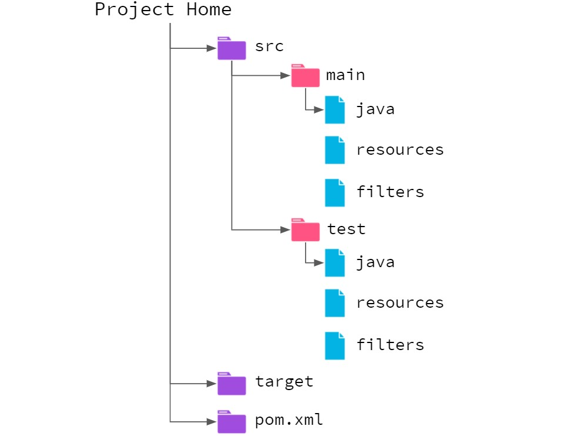
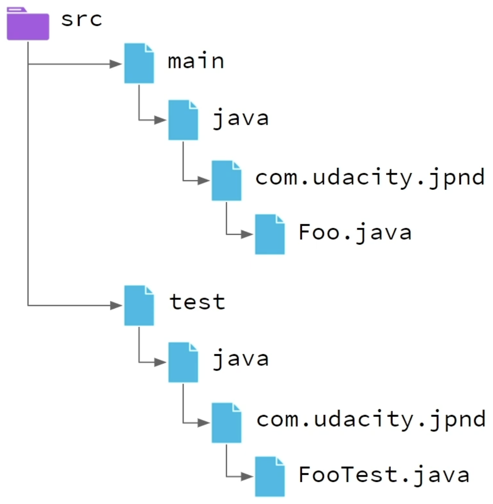

# Maven

- Maven is a build tool (performs the steps of the build process according to a configuration).

# Build Lifecycle Phases

- Maven organizes the build process into **phases** (steps of the build).
- A phase processes the **goals** (actions) attached to it. 
  - The implementation of the goal is performed by a **plugin**.

**Default phases:**

1. **Validate** - validate that the project definition (pom.xml) has a valid syntax and all the resources can be identified.
2. **Compile** - compile the program into class files.
3. **Test** - run unit tests (don't require code to be packaged or deployed).
4. **Package** - package the code into a JAR + run integration tests.
5. **Install** - move the JAR to the local copy of our Maven repo (It's where Maven stores all JARs referenced by our projects).
6. **Deploy** - copy the JAR into a remote repository (to be shared with others).

> Executing a phase will run all the preceding phases.

# Projects

> A Maven project is defined by a pom.xml.

## POM (Project Object Model)

**Minimal POM:**

```xml
<project>
  <!-- Current object model (format) version to be used with Maven-->
  <modelVersion> 4.0.0 </modelVersion>

  <!-- Group identifier of the project -->
  <groupId> com.udacity.jpnd </groupId>
  <!-- Specific identifier of the project -->
  <artifactId> maven-test </artifactId>
  <!-- Version of the artifact (keeps track of project versions) -->
  <version> 1.0.0 </version> 
</project>
```

- `groupId`
  - can be shared with other projects;
  - uses reverse domain notation (~ Java packages).

> `groupId` + `artifactId` → uniquely identifies the project

## Phases & POM

> `mvn <phase>` → runs the desired maven phase

- If we run `mvn package` with the minimal POM, Maven will create a `target` directory containing the JAR.
- The JAR only has the `META-INF` directory with the `MANIFEST.MF` file.

## Create a Maven Project

### Command line

1. `mvn archetype:generate`
2. Press enter to accept the default template (maven quickstart project).
3. Press enter again to accept the newest version of the template.
4. Fill in the required elements of a minimal POM.

Maven will create a new project directory with a `pom.xml` some starter source code and test directories.

### IntelliJ

1. File > New > Project
2. Maven Archetype 
- Archetype: choose from list `maven-archetype-quickstart`
- Advanced Settings:
  - GroupId
  - ArtifactId
  - Version
3. Create

## Standard Directory Layout



- `main`: source code + resources related to the project.
- `test`: source code + resources for testing the project.

---

- `Java`: `.Java` source files. 
- `main/resources`: Non-Java files related to running and building the project:
  - Images;
  - I18n files;
  - Local environment config;
  - Any other files used by the application  (commonly properties files).
- `test/resources`: Configuration files specific to unit testing.
- `filters`: Property files with values to inject into other resources (using variable name substitution).

> The packages within `main` and `test` folders should have the same names. 👇




## Dependencies

- **Dependency** - External Java source (often a JAR) that is not part of the program and not part of the Java standard library. 

Maven:
- Checks to see if the local repository (`/user/.m2/repository`) already has the resource we need
  - If it does not, it downloads the JAR from the Central Repository.
- Stores a single copy of each dependency in its local repository;
- Includes them as part of the project build;
- Adds them to the build path when necessary.

---

- Maven dependencies are added to the POM by providing their unique identifying information.
- If the version is not specified, it will use the newest version in the repository.

```xml
<project>
  <modelVersion> 4.0.0 </modelVersion>

  <groupId> com.udacity.jpnd </groupId>
  <artifactId> maven-test </artifactId>
  <version> 1.0.0 </version>
  
  <dependencies>
    <dependency>
        <groupId>org.junit.jupiter</groupId>
        <artifactId>junit-jupiter</artifactId>
        <version>5.7.0</version>
    </dependency>
</dependencies>
</project>
```

### Scope

> The `scope` element of a dependency tells Maven when to include that dependency.

- **Compile** - Available for all Maven actions.
  - Default.
  - Most used.
- **Test** - Only available when building and running unit tests.
- **Runtime** - Only available when application runs (not when compiled).
  - Infrequently used.
  - Some examples of this might be JDBC drivers or logging endpoints (could be utilized by other dependencies).
- **Provided** - Only available during compilation (not when run).
  - Sometimes used for dependencies that are provided by web application servers during runtime (Servlets APIs).
  - The web app server is not available during compilation, so Maven includes the dependency during the compile step.
  - But when the application is executed, we are expecting our web server to provide the dependency, and so Maven does not include it.
- **Import** - Import all dependencies from another POM.
  - Almost never used.

```xml
<project>
  <modelVersion> 4.0.0 </modelVersion>

  <groupId> com.udacity.jpnd </groupId>
  <artifactId> maven-test </artifactId>
  <version> 1.0.0 </version>
  
  <dependencies>
    <dependency>
        <groupId>org.junit.jupiter</groupId>
        <artifactId>junit-jupiter</artifactId>
        <version>5.7.0</version>
        <scope>test</scope>
    </dependency>
</dependencies>
</project>
```

### Type

> The `type` element tells Maven what type of artifact is provided by a dependency.

> The value for this element should correspond to the type provided by the `packaging` element in that dependency's POM. 

- **jar** - default Java archive.
- **war** - web archive.
- **ear** - enterprise archive → contains >=1 war file(s) + Enterprise Java Bean (ejb) modules (packaged as jars).
- **rar** - resource adapter (used by Enterprise Java applications to enable access to foreign systems).
- **maven-plugin** - package a project to be used as a maven plugin.
- **pom** - the POM of the project is the primary artifact to produce.
  - parent projects containing multiple modules
  - projects that we wish to include using 'import' scope dependencies.


```xml
<project>
  <modelVersion> 4.0.0 </modelVersion>

  <groupId> com.udacity.jpnd </groupId>
  <artifactId> maven-test </artifactId>
  <version> 1.0.0 </version>
  
  <packaging>jar</packaging>
  
  <dependencies>
    <dependency>
        <groupId>org.junit.jupiter</groupId>
        <artifactId>junit-jupiter</artifactId>
        <version>5.7.0</version>
        <scope>test</scope>
        <!-- Include this dependency as a JAR.
        Unnecessary (JAR is the default), but necessary if it came as a different kind of package. -->
        <type>jar</type>
    </dependency>
</dependencies>
</project>
```
