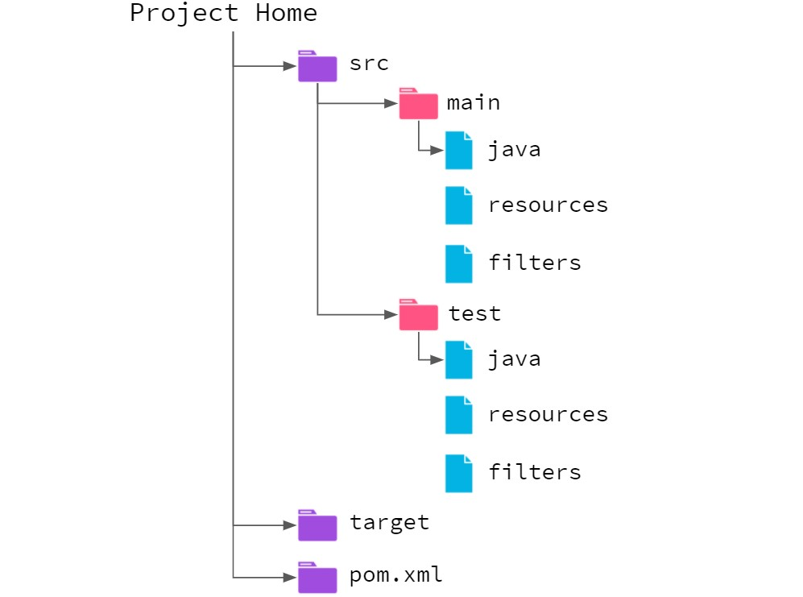
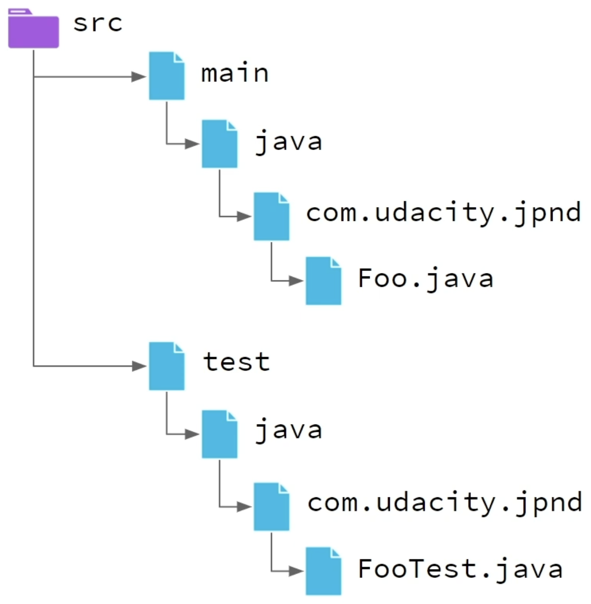
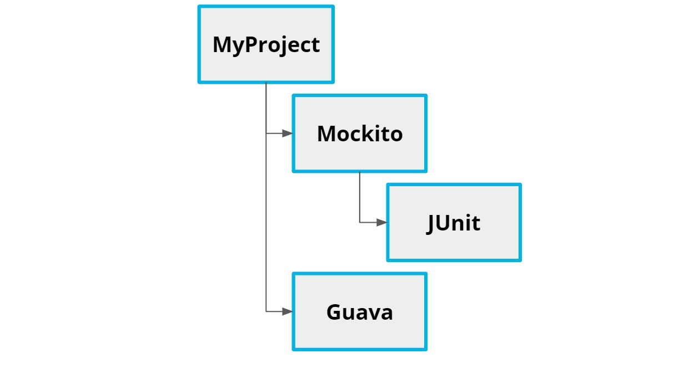
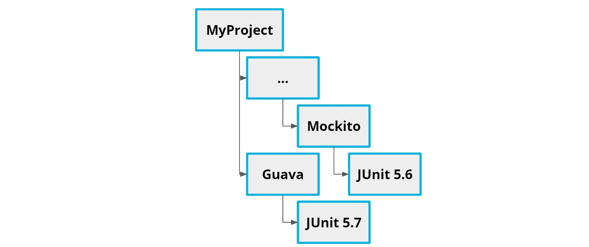

## Index

- [Maven](#maven)
  - [Build Lifecycle Phases](#build-lifecycle-phases)
  - [Projects](#projects)
    - [POM](#pom-project-object-model)
    - [Phases & POM](#phases--pom)
    - [Create a Maven Project](#create-a-maven-project)
      - [Command line](#command-line)
      - [IntelliJ](#intellij)
    - [Standard Directory Layout](#standard-directory-layout)
    - [Dependencies](#dependencies)
      - [Scope](#scope)
      - [Type](#type)
      - [Transitive](#transitive)
    - [Inheritance](#inheritance)
    - [Multiple Modules](#multiple-modules)
  - [Plugins](#plugins)
    - [Customizing](#customizing)
  - [Properties](#properties)
    - [Automatic](#automatic)
  - [Reporting](#reporting)

# Maven

- Maven is a build tool (performs the steps of the build process according to a configuration).

## Build Lifecycle Phases

- Maven organizes the build process into **phases** (steps of the build).
- A phase processes the **goals** (actions) attached to it.
    - The implementation of the goal is performed by a **plugin**.

**Default main phases:**

1. **Validate** - validate that the project definition (pom.xml) has a valid syntax and all the resources can be
   identified.
2. **Compile** - compile the program into class files.
3. **Test** - run unit tests (don't require code to be packaged or deployed).
4. **Package** - package the code into a JAR + run integration tests.
5. **Install** - move the JAR to the local copy of our Maven repo (It's where Maven stores all JARs referenced by our
   projects).
6. **Deploy** - copy the JAR into a remote repository (to be shared with others).

> Executing a phase will run all the preceding phases.

## Projects

> A Maven project is defined by a pom.xml.

### POM (Project Object Model)

**Minimal POM:**

```xml

<project>
    <!-- Current object model (format) version to be used with Maven-->
    <modelVersion>4.0.0</modelVersion>

    <!-- Group identifier of the project -->
    <groupId>com.udacity.jpnd</groupId>
    <!-- Specific identifier of the project -->
    <artifactId>maven-test</artifactId>
    <!-- Version of the artifact (keeps track of project versions) -->
    <version>1.0.0</version>
</project>
```

- `groupId`
    - can be shared with other projects;
    - uses reverse domain notation (~ Java packages).

> `groupId` + `artifactId` → uniquely identifies the project

### Phases & POM

> `mvn <phase>` → runs the desired maven phase

- If we run `mvn package` with the minimal POM, Maven will create a `target` directory containing the JAR.
- The JAR only has the `META-INF` directory with the `MANIFEST.MF` file.

### Create a Maven Project

#### Command line

1. `mvn archetype:generate`
2. Press enter to accept the default template (maven quickstart project).
3. Press enter again to accept the newest version of the template.
4. Fill in the required elements of a minimal POM.

Maven will create a new project directory with a `pom.xml` some starter source code and test directories.

#### IntelliJ

1. File > New > Project
2. Maven Archetype

- Archetype: choose from list `maven-archetype-quickstart`
- Advanced Settings:
    - GroupId
    - ArtifactId
    - Version

3. Create

### Standard Directory Layout



- `main`: source code + resources related to the project.
- `test`: source code + resources for testing the project.

---

- `Java`: `.Java` source files.
- `main/resources`: Non-Java files related to running and building the project:
    - Images;
    - I18n files;
    - Local environment config;
    - Any other files used by the application  (commonly properties files).
- `test/resources`: Configuration files specific to unit testing.
- `filters`: Property files with values to inject into other resources (using variable name substitution).

> The packages within `main` and `test` folders should have the same names. 👇



### Dependencies

- **Dependency** - External Java source (often a JAR) that is not part of the program and not part of the Java standard
  library.

Maven:

- Checks to see if the local repository (`~/.m2/repository`) already has the resource we need
    - If it does not, it downloads the JAR from the Central Repository.
- Stores a single copy of each dependency in its local repository;
- Includes them as part of the project build;
- Adds them to the build path when necessary.

---

- Maven dependencies are added to the POM by providing their unique identifying information.
- If the version is not specified, it will use the newest version in the repository.

```xml

<project>
    <modelVersion>4.0.0</modelVersion>

    <groupId>com.udacity.jpnd</groupId>
    <artifactId>maven-test</artifactId>
    <version>1.0.0</version>

    <dependencies>
        <dependency>
            <groupId>org.junit.jupiter</groupId>
            <artifactId>junit-jupiter</artifactId>
            <version>5.7.0</version>
        </dependency>
    </dependencies>
</project>
```

#### Scope

> The `scope` element of a dependency tells Maven when to include that dependency.

- **Compile** - Available for all Maven actions.
    - Default.
    - Most used.
- **Test** - Only available when building and running unit tests.
- **Runtime** - Only available when application runs (not when compiled).
    - Infrequently used.
    - Some examples of this might be JDBC drivers or logging endpoints (could be utilized by other dependencies).
- **Provided** - Only available during compilation (not when run).
    - Sometimes used for dependencies that are provided by web application servers during runtime (Servlets APIs).
    - The web app server is not available during compilation, so Maven includes the dependency during the compile step.
    - But when the application is executed, we are expecting our web server to provide the dependency, and so Maven does
      not include it.
- **Import** - Import all dependencies from another POM.
    - Almost never used.

```xml

<project>
    <modelVersion>4.0.0</modelVersion>

    <groupId>com.udacity.jpnd</groupId>
    <artifactId>maven-test</artifactId>
    <version>1.0.0</version>

    <dependencies>
        <dependency>
            <groupId>org.junit.jupiter</groupId>
            <artifactId>junit-jupiter</artifactId>
            <version>5.7.0</version>
            <scope>test</scope>
        </dependency>
    </dependencies>
</project>
```

#### Type

> The `type` element tells Maven what type of artifact is provided by a dependency.

> The value for this element should correspond to the type provided by the `packaging` element in that dependency's POM.

- **jar** - default Java archive.
- **war** - web archive.
- **ear** - enterprise archive → contains >=1 war file(s) + Enterprise Java Bean (ejb) modules (packaged as jars).
- **rar** - resource adapter (used by Enterprise Java applications to enable access to foreign systems).
- **maven-plugin** - package a project to be used as a maven plugin.
- **pom** - the POM of the project is the primary artifact to produce.
    - parent projects containing multiple modules
    - projects that we wish to include using 'import' scope dependencies.

```xml

<project>
    <modelVersion>4.0.0</modelVersion>

    <groupId>com.udacity.jpnd</groupId>
    <artifactId>maven-test</artifactId>
    <version>1.0.0</version>
    <!-- Unnecessary (JAR is the default), but necessary if we wanted to use another packaging type -->
    <packaging>jar</packaging>

    <dependencies>
        <dependency>
            <groupId>org.junit.jupiter</groupId>
            <artifactId>junit-jupiter</artifactId>
            <version>5.7.0</version>
            <scope>test</scope>
            <!-- Include this dependency as a JAR.
            Unnecessary (JAR is the default), but necessary if it came as a different kind of package -->
            <type>jar</type>
        </dependency>
    </dependencies>
</project>
```

#### Transitive

**Transitive dependency** - resource required by one of the dependencies included in your project.



- JUnit is a Transitive Dependency of this project.
- If the project has multiple transitive dependencies:
    - all at the same depth - 1st declared in the POM wins (in the image above is the JUnit version from Mockito);
    - nested - shallowest depth wins (in the image below is the JUnit version from Guava).



To resolve transitive dependency confusion, there are 2 options:

- Directly include the dependency in question (that version becomes the nearest definition and wins).
- Use the `<exclusion>` tag to specifically exclude versions we do not wish to use.

> This example will exclude the version of JUnit from Mockito, resulting in an included version from Guava.

```xml

<project>
    <modelVersion>4.0.0</modelVersion>

    <groupId>com.udacity.jpnd</groupId>
    <artifactId>maven-test</artifactId>
    <version>1.0.0</version>

    <dependencies>
        <dependency>
            <groupId>org.mockito</groupId>
            <artifactId>mockito</artifactId>
            <exclusions>
                <exclusion>
                    <groupId>org.junit.jupiter</groupId>
                    <artifactId>junit</artifactId>
                </exclusion>
            </exclusions>
        </dependency>

        <dependency>
            <groupId>com.google.guava</groupId>
            <artifactId>guava</artifactId>
        </dependency>
    </dependencies>
</project>
```

### Inheritance

All POMs in Maven inherit from the [**Super POM**](https://maven.apache.org/pom.html#the-super-pom).

> **Super POM** - contains the default settings used by Maven (we can override them with settings in our POM).

We can define an additional inheritance hierarchy by having a **parent POM** (should specify the `packaging` type pom).

```xml

<project>
    <modelVersion>4.0.0</modelVersion>

    <groupId>com.udacity.jpnd</groupId>
    <artifactId>maven-test-parent</artifactId>
    <version>1.0.0</version>
    <packaging>pom</packaging>

    <dependencies>
        <dependency>
            <groupId>org.junit.jupiter</groupId>
            <artifactId>junit</artifactId>
        </dependency>
    </dependencies>
</project>
```

**Child POM** for UserService - inherits dependencies from the parent POM (defined in the `parent` tag), which means we
don't need to specify JUnit here.

```xml

<project>
    <parent>
        <groupId>com.udacity.jpnd</groupId>
        <artifactId>maven-test-parent</artifactId>
        <version>1.0.0</version>
    </parent>

    <groupId>com.udacity.jpnd</groupId>
    <artifactId>UserService</artifactId>
    <version>1.0.0</version>
</project>
```

### Multiple Modules

What if we wanted to make a single project that would build both our UserService and SalesService artifacts at the same
time?

We can use the `modules` tag in the **parent POM** that lists both services as **Modules**.

Now, when we run `mvn package`, both projects will be built.

```xml

<project>
    <modelVersion>4.0.0</modelVersion>

    <groupId>com.udacity.jpnd</groupId>
    <artifactId>maven-test-parent</artifactId>
    <version>1.0.0</version>
    <packaging>pom</packaging>

    <modules>
        <module>UserService</module>
        <module>SalesService</module>
    </modules>

    <dependencies>
    </dependencies>
</project>
```

#### Create a multi-module maven project from scratch

1. `mvn archetype:generate` -> pom-root -> fill all the details.
2. `cd` to the new directory.
3. `mvn archetype:generate` -> accept the default -> fill all the details.
4. The parent pom will be updated to include `modules`.
5. Repeat the process for all the child projects.

We can also use IntelliJ wizard or do this manually.

## Plugins

> All Maven goals are performed by plugins.

Default plugin bindings for each phase in JAR projects (`<groupId>:<pluginArtifactId>:<version>:<goal>`):

1. **validate**
2. **process-resources** - org.apache.maven.plugins:maven-resources-plugin:2.6:resources
3. **compile** - org.apache.maven.plugins:maven-compiler-plugin:3.1:compile
4. **process-test-resources** - org.apache.maven.plugins:maven-resources-plugin:2.6:testResources
5. **test-compile** - org.apache.maven.plugins:maven-compiler-plugin:3.1:testCompile
6. **test** - org.apache.maven.plugins:maven-surefire-plugin:2.12.4:test
7. **package** - org.apache.maven.plugins:maven-jar-plugin:2.4:jar
8. **install** - org.apache.maven.plugins:maven-install-plugin:2.4:install
9. **deploy** - org.apache.maven.plugins:maven-deploy-plugin:2.7:deploy

```xml

<project>
    <modelVersion>4.0.0</modelVersion>

    <groupId>com.udacity.jpnd</groupId>
    <artifactId>maven-test-parent</artifactId>
    <version>1.0.0</version>
    <packaging>pom</packaging>

    <modules>
        <module>UserService</module>
        <module>SalesService</module>
    </modules>

    <dependencies>
        <dependency>
            <groupId>org.junit.jupiter</groupId>
            <artifactId>junit</artifactId>
        </dependency>
    </dependencies>

    <!-- <build> includes properties that affect the execution of Maven goals -->
    <build>
        <!-- Specify which plugins to use for our project or override the properties of the default plugins -->
        <plugins>
            <plugin>
                <!-- Customization for this project only -->
            </plugin>
        </plugins>

        <pluginManagement>
            <plugins>
                <plugin>
                    <!-- Customization for all projects that inherit this as well -->
                </plugin>
            </plugins>
        </pluginManagement>
    </build>
</project>
```

### Customizing

```xml

<project>
    <modelVersion>4.0.0</modelVersion>

    <groupId>com.udacity.jpnd</groupId>
    <artifactId>maven-test-parent</artifactId>
    <version>1.0.0</version>
    <packaging>pom</packaging>

    <modules>
    </modules>

    <dependencies>
    </dependencies>

    <build>
        <plugins>
            <plugin>
                <!-- When the groupId is org.apache.maven.plugin, we don't need to include it because that is the default -->
                <groupId>com.udacity.jpnd</groupId>
                <artifactId>my-blockcahin-plugin</artifactId>

                <executions>
                    <!-- <execution> binds a plugin goal to a phase -->
                    <execution>
                        <phase>test</phase>

                        <goals>
                            <goal>do-blockchain</goal>
                        </goals>

                        <!-- <configuration> allows us to pass additional properties to plugins -->
                        <configuration>
                            <bitcoins>all</bitcoins>
                        </configuration>
                    </execution>
                </executions>
            </plugin>
        </plugins>

        <pluginManagement>
        </pluginManagement>
    </build>
</project>
```

## Properties

The properties `maven.compiler.source` and `target` set the version value that will be used by the
`maven-compiler-plugin`.
We could do the same thing by configuring the plugin directly (in the `configuration` element).

We can define our own properties and reference them elsewhere in our POM (e.g., `some.plugin.version`).

```xml

<project>
    <modelVersion>4.0.0</modelVersion>

    <groupId>com.udacity.jpnd</groupId>
    <artifactId>maven-test-parent</artifactId>
    <version>1.0.0</version>
    <packaging>pom</packaging>

    <properties>
        <maven.compiler.source>1.8</maven.compiler.source>
        <maven.compiler.target>1.8</maven.compiler.target>
        <some.plugin.version>2.0</some.plugin.version>
    </properties>

    <modules>
    </modules>

    <dependencies>
    </dependencies>

    <build>
        <pluginManagement>
            <plugins>
                <plugin>
                    <groupId>org.apache.maven.plugins</groupId>
                    <artifactId>maven-compiler-plugin</artifactId>
                    <version>3.8.1</version>

                    <configuration>
                        <source>1.7</source>
                        <target>1.7</target>
                    </configuration>
                </plugin>
            </plugins>

            <plugin>
                <groupId>my.group</groupId>
                <artifactId>some-plugin</artifactId>
                <version>${some.plugin.version}</version>
            </plugin>
        </pluginManagement>
    </build>
</project>
```

### Automatic

- **Environment variables** - any variables in the shell's environment.
    - `${env.VAR_NAME}` (e.g., `${env.PATH}`).
- **POM elements** - values in the POM can be referenced according to their place in the object structure.
    - e.g., `${project.groupId}` (to reference the `<project><groupId>value</groupId></project>`)
- **Settings.xml** - users can provide customizations to their Maven profile in a `settings.xml` file.
    - `${settings.propName}`
- **Java System properties** - anything provided by `java.lang.System.getProperties()`.
    - `${java.propName}`

## Reporting

> Happens during a phase called `site` (it is not part of the default JAR lifecycle).

`mvn site` - generates documentation about the project.
We can customize this behavior by adding additional plugins to the `reporting` element (at the top level of the
`project` element).

For example, we can run the JavaDoc plugin during the site phase:

```xml

<project>
    <modelVersion>4.0.0</modelVersion>

    <groupId>com.udacity.jpnd</groupId>
    <artifactId>maven-test-parent</artifactId>
    <version>1.0.0</version>
    <packaging>pom</packaging>

    <properties>
    </properties>

    <modules>
    </modules>

    <dependencies>
    </dependencies>

    <build>
    </build>

    <reporting>
        <plugins>
            <plugin>
                <groupId>org.apache.maven.plugins</groupId>
                <artifactId>maven-javadoc-plugin</artifactId>
                <version>3.2.0</version>
            </plugin>
        </plugins>
    </reporting>
</project>
```
