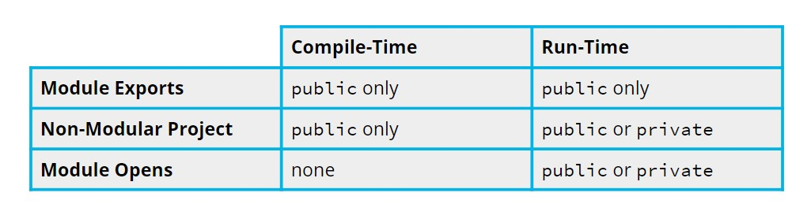
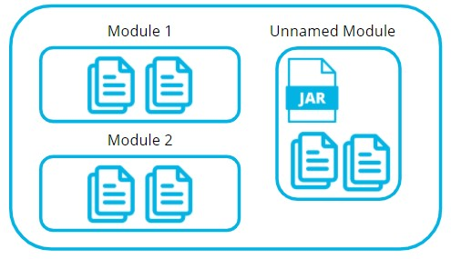
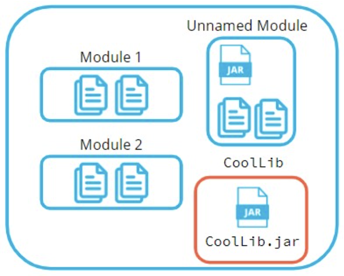

# What is a Module

A Module is a JAR.

Modules contain:

- classes in packages;
- `META-INF` directory with `MANIFEST.MF` - declares class metadata;
- `module-info.java` = **Module Descriptor**:
  - indicates which packages the module makes available, and which modules this module relies on;
  - at the top level of the `src/main/java` directory.

# Defining Modules

## Keywords

`module-info.java`:

```java
module com.udacity.jpnd.module1 {
    exports com.udacity.jpnd.module1.somepackage;
    requires com.udacity.jpnd.module2;
}
```

- `exports` - `com.udacity.jpnd.module1.somepackage` should be available to users of this module (does not include
  subpackages).
  - Compile-time access.
- `requires` - makes the packages in `com.udacity.jpnd.module2` module available in `com.udacity.jpnd.module1`.
  - Circular dependencies will not compile.

## Additional Keywords

`module-info.java`:

```java
module com.udacity.jpnd.module1 {
    exports com.udacity.jpnd.module1.publicpackage;
    exports com.udacity.jpnd.module1.internalpackage to com.udacity.jpnd.module3;

    opens com.udacity.jpnd.module1.somepackage to some.unit.test.framework;

    requires transitive com.udacity.jpnd.module2;
}
```

- `to`: modifies `exports` to limit which modules can access the specified package.
- `transitive`: modifies `requires` to specify that the required module will also be made available to any other module
  that include `com.udacity.jpnd.module1`.
- `opens`: Makes `com.udacity.jpnd.module1.somepackage` available for both public and private class reflection access.
  - Runtime access.
  - Can use the `to` keyword to limit which modules have this access.



## Java Service Provider Interface ([SPI](https://docs.oracle.com/javase/9/docs/api/java/util/ServiceLoader.html))

A way for Java to dynamically discover and load implementations for a specified interface.

```java
// Service Provider
module module1 {
    exports module1.somepackage;
    provides module1.somepackage.MyInterface with module1.somepackage.MyInterfaceImpl;
}

// Service Consumer
module module2 {
    requires module1;
    uses module1.somepackage.MyInterface;
}
```

- `provides`/`with` (service provider)
- `uses` (service consumer)

# Module Types

## CLASSPATH
 - Before modules;
 - Where the compiler looks for all class files.

## MODULEPATH
- With modules;
- Where the compiler looks for all modules.

## Unnamed Module

- All Java applications compiled in Java 9+ use the module system.
- Even if they contain no modules and do not use a module descriptor, everything placed on the CLASSPATH is placed into the Unnamed Module.



## Automatic Module

- **Unnamed Module** cannot access content in **Names Modules**, because it cannot use the `requires` statement.
- **Named Modules** cannot access the **Unnamed Module**, because the **Unnamed Module** cannot be referenced by `requires`.

The solution to this problem is **Automatic Module**.

**Automatic Modules** are created by placing non-modular jars on the MODULEPATH.



If the project has dependencies, they can be placed on the MODULEPATH so that they become automatic modules which we can reference by name in the module descriptor.

MANIFEST.MF:
```mf
Manifest-Version: 1.0
Build-Jdk: 14.0.1
Automatic-Module-Name: com.udacity.CoolLib
```

The default name of automatic modules is the name of the jar (`CoolLib` in this case), but that name can be overridden by the `Automatic-Module-Name` property in the JAR Manifest.
We can then reference the module using `requires`.

module-info.java:
```java
module mymodule {
    requires com.udacity.CoolLib;
}
```

## Module Access

|            | Named Module        | Unnamed Module        | Automatic Module              |
|------------|---------------------|-----------------------|-------------------------------|
| Created By | `module-info.java`  | Jar on CLASSPATH      | Jar on MODULEPATH             |
| Exports    | In `module-info`    | n/a                   | Everything                    |
| Opens      | In `module-info`    | n/a                   | Everything                    |
| Requires   | In `module-info`    | n/a                   | Everything                    |
| Can Access | Named and Automatic | Unnamed and Automatic | Named, Unnamed, and Automatic |

# Java Linker

To run a Java app, we need 1 of these:
- have Java installed;
- an installer for the app that bundles the entire JRE with the app.

**JLink**: tool that allows us to create a custom Java Runtime Environment containing the minimal components necessary to run a specific Java module.
- This is possible because module descriptors contain specific information about package requirements and the core JDK libraries are all stored in modular form.

1. Compile all classes and build them into a jar.
- `mvn package`

2. Create a new jar called `Example.jar` with a main class in `com.udacity.jpnd.App` that's using the classes from the `target/classes` directory.
- `jar -cfe Example.jar com.udacity.jpnd.App -C target/classes .`

3. See the output of the program.
- `java -jar Example.jar`

4. Analyze Dependencies - make sure that all dependencies can be resolved.
- `jdeps Example.jar`
- This shows all the dependencies required by the program and where they are located.
- If the program has additional dependencies, we can use jdeps to determine whether we need to manually include additional packages in the jar.

5. Building Runtime - put all the required modules on the modulepath (for example, the module for our program + `java.base`);

- `--module-path` (x2) - places 2 directories on the module path:
  - 1 - `$JAVA_HOME/jmods` (contains all the modules for the JDK bundled into jmod files);
  - 2 - `target/classes` (class files for a program);
- `--add-modules` - `com.udacity.jpnd.moduletest` (module to add to our JRE);
- `--output` - `tinyJRE` (output directory);

> `jlink --module-path "$JAVA_HOME/jmods" --module-path target/classes --add-modules com.udacity.jpnd.moduletest --output tinyJRE`

- The modules comprising the Java Standard Library can be found in the `/jmods` directory of our Java installation.

6. Using the Runtime
- The tinyJRE directory is less than 40 MB and contains a complete Java Runtime that can run our program.
- `tinyJRE/bin/java -jar Example.jar`